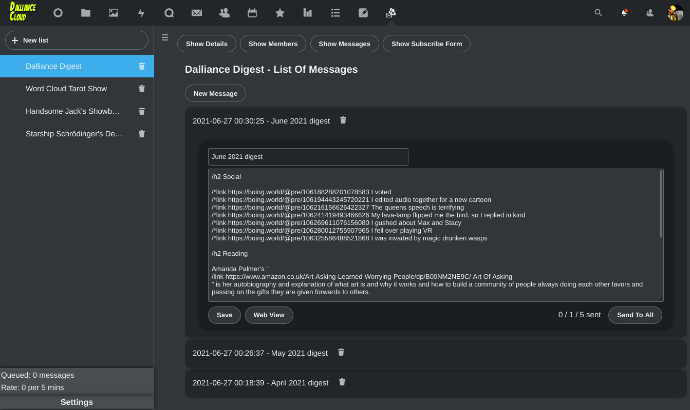
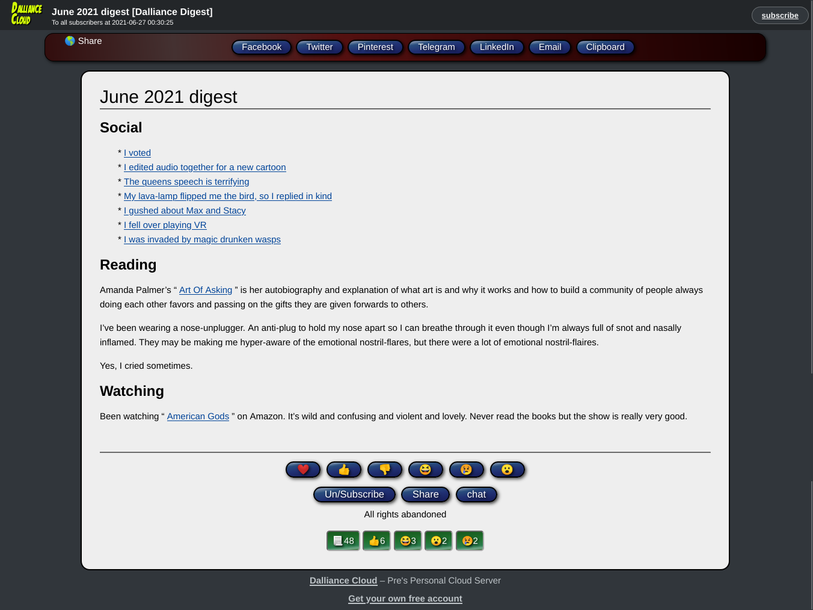

# Listman

This is a simple mailing-list manager.

It uses a separate SMTP configuration to the main Nextcloud
app, because often your "Transactional-only" email provider
will not allow mailing-list type email.

You will need to use the app as an Admin user to set those
SMTP settings before a non-admin user may use it.

Features:

* Multiple mailing-lists
* Subscribe/Unsubscribe forms
* A Web-view of each email sent, with "share on X" for
  * facebook
  * twitter
  * linked in
  * pinterest
  * Telegram
  * Email
  * Copy-link-to-clipboard
* Emojii React buttons on each email, tracked on the web-view page
* Every email has Un/Subscribe link
* Every email has "Forward" link, linking to the web-view
* Can assign a third button text and link per mail-list (I label it "chat" and link to a telegram group, you do what works for you)
* Footer per list for every email sent. 
* Allows subscribe-form to be generated for external site to link to Listman
* Max-Per-Day email settings, with queueing and warnings to users when exceeded
* Slowly but exponentially increase in send-rate
* HTML:
  * Headers
  * Links
  * Image-links
  * Bullet-links
* Sane plain-text version of every email too.

## Screenshots

The compose screen and a web-view of the email sent:




## Message Syntax

In composed messages you may use special commands. Put them in a
line of their own starting with a slash.

### Headers
EG:
```
   /h1 Welcome To This Email
```

Can use /h1 or /h2 or /h3 or /h4 

The rest of the line specifies the headline text.

### Links
EG:
```
   /link https://dalliance.net/ My Home Page
```

Specify the link first, then the text for the link in the rest of the line.

### Bullet Links
EG:
```
   /*link https://dalliance.net/ Homepage One
   /*link https://starshipsd.com/ My VR Cartoons
   /*link https://wordcloudtarot.com/ My tarot readings
   /*link https://tentacles.org.uk/ My tentacle monster cartoon
```

I find I want a bullet-point list of links often, so that's
for that.

### Image Links
EG:
```
   /img https://dalliance.net/avatar.jpg My Avatar with alt-text
```

Add an image in-line by linking to the Image's URL and 
adding alt-text/title for the rest of the line.


## Description

Your lists are in the left-hand column. Click one, or the "new list" button to create one.

You then have four buttons on the right-hand display:
* Show Details
* Show Members
* Show Messages
* Show Subscribe Form

### Show Details
Allows you to edit the title of the list, it's description, the name
and email of the "sender", the name and link for the 3rd button,
a footer, and a URL to return to after a subscribe.

### Show Members
Lists the member's names, emails, and their status.

Status may be:
* Unconfirmed
* Subscribed
* Blocked
* Queued

It only hits "Queued" if we can't send a confirmation message
due to sending-limits.

You may add a new member, edit or delete existing ones,
but usually you'd prefer to allow users to sign up with
the subscribe-form I'd think.

Messages only get sent to "Subscribed" members, though
every morning the Queued ones get converted into "unconfirmed"
as some confirmation emails get sent.


### Show messages

Lists the messages sent to the list, and allows composing a new one.

Each message has a "Web View" link to preview how it should look.
Viewing that link *will* increment the view-counter for the message.

Each message has a "Stats" link, to show (or fetch via api) the number
if views and reactions to the message.

Each message has a "widget" button, which will show the HTML of
a widget to embed in a web-page equivalent of the message. Paste
this into a web-page to make it have react-buttons and view-counters
similar to the web-view.

It is NOT "what you see is what you get", email never can be really.

You may special commands to add links, images, headers etc.

It has a "Send to all" button, which will queue sending to all the members of the list.

### Show Subscribe Form

You can copy/paste the text shown into your website to 
add a "subscribe" form to that website.

It also has a button linking to the native subscribe-form
in case there is no website to link from.


## Settings

Settings panel is shown only to admin Nextcloud users.

It allows setting of SMTP details, and the limit of max-per-day
emails that the system will send.

## Install
To install it change into your Nextcloud's apps directory:

    cd nextcloud/apps

Then run:

    git clone https://github.com/revpriest/listman.git listman

Then install the dependencies using:

    make composer

## Frontend development

- Run `make dev-setup` to install the frontend dependencies
- To build the Javascript whenever you make changes, run `make build-js`

